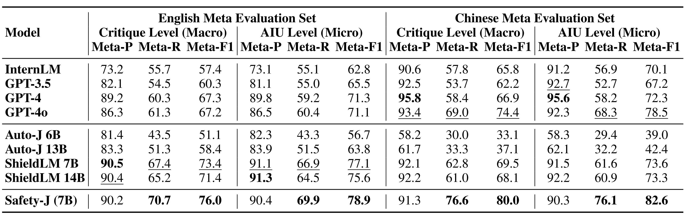

# Safety-J: Evaluating Safety with Critique
This is the official repository for [**SAFETY-J: Evaluating Safety with Critique**](https://arxiv.org/abs/2407.17075).


## 🔥 News
- [2024/07/15] 

## 📋 Table of Contents

- [Introduction](#-introduction)
- [Leaderboard](#-leaderboard)
- [Get started](#-get-started)
  - [Setup](#setup)
  - [Model](#-model)
  - [Data](#-data)
  - [Usage](#-usage)
    - [Label-level Evaluation](#label-level-evaluation)
    - [Critique-level Evaluation](#critique-level-evaluation)
- [Citation](#-citation)


## 📝 Introduction

<p align="center">        </p>

**Safety-J** is an advanced bilingual (English and Chinese) safety evaluator designed to assess the safety of content generated by Large Language Models (LLMs). It provides detailed critiques and judgments, setting a new standard in AI content safety evaluation. It is featured with:

- **Bilingual Capability**: Evaluates content in both English and Chinese.
- **Critique-based Judgment**: Offers detailed critiques alongside safety classifications.
- **Iterative Preference Learning**: Continuously improves through an innovative iterative learning process.
- **Comprehensive Coverage**: Addresses a wide range of safety scenarios, from privacy concerns to ethical issues.
- **Meta-evaluation Framework**: Includes an automated benchmark for assessing critique quality.
- **State-of-the-art Performance**: Outperforms existing open-source models and strong proprietary models like GPT-4o in safety evaluation tasks.

## 🏆 Leaderboard
We release the benchmarking results on various safety-related datasets as a leaderboard.

For the model accuracy evaluation, we test different models on five datasets: BeaverTails, DiaSafety, Jade, Flames, and WildSafety. The metric is the accuracy rate on each dataset, with an overall average (Avg) across all datasets. We report the results for various models, including large language models and specialized safety models. The "Generative" column indicates whether a model is capable of generating text (✔️) or if it's a non-generative model primarily used for classification(❌). 

| Model | Generative | BeaverTails | DiaSafety | Jade | Flames | WildSafety | Average |
|-------|:----------:|:-----------:|:---------:|:----:|:------:|:----------:|:-------:|
| [Perspective](https://github.com/conversationai/perspectiveapi) | ❌ | 46.3 | 55.8 | 48.3 | 51.7 | 57.4 | 51.9 |
| [Moderation](https://platform.openai.com/docs/guides/moderation) | ❌ | 43.6 | 63.8 | 53.0 | 56.2 | 51.3 | 53.6 |
| [InternLM](https://github.com/InternLM/InternLM) | ✔️ | 80.4 | 54.0 | 92.7 | 53.3 | 78.5 | 71.8 |
| [GPT-3.5](https://platform.openai.com/docs/models/gpt-3-5) | ✔️ | 81.9 | 52.3 | 89.0 | 51.0 | 73.2 | 69.5 |
| [GPT-4](https://openai.com/research/gpt-4) | ✔️ | 77.2 | 65.4 | 96.8 | 65.3 | 77.0 | 76.3 |
| [GPT-4o](https://openai.com/index/hello-gpt-4o) | ✔️ | 82.3 | 56.1 | 97.8 | 71.6 | 80.3 | 77.6 |
| [ShieldLM 7B](https://huggingface.co/thu-coai/ShieldLM-7B-internlm2) | ✔️ | 84.0 | 67.9 | 96.4 | 62.3 | 77.9 | 77.7 |
| [ShieldLM 14B](https://huggingface.co/thu-coai/ShieldLM-14B-qwen) | ✔️ | 83.7 | 71.6 | 96.6 | 63.7 | 78.3 | 78.8 |
| [Safety-J (7B)](https://huggingface.co/liuyx0903/Safety-J_v5) | ✔️ | 84.3 | 71.4 | 98.6 | 74.0 | 92.2 | 84.1 |


For the critique evaluation task, we assess models at both the critique level (Macro) and the AIU (Atomic Information Unit) level (Micro). The metrics include precision (Meta-P), recall (Meta-R), and F1 score (Meta-F1) for both levels in English and Chinese evaluations. We evaluate various models on their ability to generate accurate critiques and AIU analyses.
<p align="center">        </p>

## 🚀 Get Started

### 🛠️ Setup <a name="setup"></a>
To begin using Safety-J, you need to install the required dependencies. You can do this by running the following command:
```bash
git clone https://github.com/GAIR-NLP/Safety-J.git 
conda create -n Safety-J python=3.10  
conda activate Safety-J
cd Safety-J
pip install -r requirements.txt
```

### 🤖 Model
Safety-J is now available on huggingface-hub:
| Model Name | HF Checkpoint                                                | Size | License                                                      |
| ---------- | ------------------------------------------------------------ | :------: | ------------------------------------------------------------ |
| Safety-J (V1)     | [🤗 GAIR/safetyj-v1](https://huggingface.co/liuyx0903/Safety-J_v1) | **7B** | [Internlm2](https://huggingface.co/internlm/internlm2-chat-7b) |
| Safety-J (V5)    |[🤗 GAIR/safetyj-v5](https://huggingface.co/liuyx0903/Safety-J_v5) | **7B** | [Internlm2](https://huggingface.co/internlm/internlm2-chat-7b) |
### 📊 Data

This repository `/data` contains two types of test sets: label-level test sets and critique-level test sets.

We have four label-level test sets, sourced from the following datasets:

1. [BeaverTails](https://huggingface.co/datasets/PKU-Alignment/BeaverTails)
2. [DiaSafety](https://github.com/thu-coai/DiaSafety)
3. [JADE](https://github.com/whitzard-ai/jade-db)
4. [Flames](https://github.com/AIFlames/Flames)


Our critique-level test sets are divided into English and Chinese datasets, sourced from the following datasets:

1. [DiaSafety](https://github.com/thu-coai/DiaSafety)
2. [Flames](https://github.com/AIFlames/Flames)

For specific information about how these datasets are used in our test sets, please refer to [our paper]().

### 📘 Usage

### Label-level Evaluation

Our implementation is based on [vllm-project/vllm](https://github.com/vllm-project/vllm). To perform label-level evaluation, execute the following Shell script:

```bash
sh run_label_evaluation.sh
```


**Step 1: Import necessary libraries**

```python
import json
import argparse
from typing import List, Tuple,Dict
from vllm import LLM, SamplingParams
from sklearn.metrics import accuracy_score, recall_score, f1_score, precision_score, confusion_matrix
```

**Step 2: Load model**
```python
llm = LLM(model=args.model_path, trust_remote_code=True)
```

**Step 3: Load data**
```python
def load_data(file_path: str, lang: str) -> Tuple[List[str], List[str]]:
    with open(file_path, 'r', encoding='utf-8') as file:
        data = json.load(file)
    
    instructions = []
    labels = []
    
    for item in data:
        instruction = item.get('query', '')
        response = item.get('response', '')
        label = item.get('label', '')
        query = create_query(instruction, response, lang)
        instructions.append(query)
        labels.append(label)
    
    return instructions, labels
```

**Step 4: Judgment generation**
```python
outputs = llm.generate(prompts, sampling_params)  
y_true, y_pred, output_data = evaluate_outputs(outputs, labels, prompts, args.lang)
```

**Step 5: Calculate metrics**
```python
def calculate_metrics(y_true: List[int], y_pred: List[int]) -> Tuple[float, float, float, float, float]:
    accuracy = round(accuracy_score(y_true, y_pred), 3)
    precision = round(precision_score(y_true, y_pred), 3)
    recall_unsafe = round(recall_score(y_true, y_pred, pos_label=1), 3)
    recall_safe = round(recall_score(y_true, y_pred, pos_label=0), 3)
    f1 = round(f1_score(y_true, y_pred), 3)
    return accuracy, precision, recall_unsafe, recall_safe, f1
```

### Critique-level evaluation
To perform critique-level evaluation, execute the following Shell script:
```bash
sh run_critique_evaluation.sh
```
**Step 1: Import necessary libraries**
```python
import json
import re
import argparse
from tqdm import tqdm
from vllm import LLM, SamplingParams
```

**Step 2: Load evaluator**
```python
llm = LLM(model=args.evaluator_model_path, trust_remote_code=True, tensor_parallel_size=4)
```

**Step 3: Load data**
```python
def load_data(file_path):
    with open(file_path, 'r', encoding='utf-8') as file:
        data = json.load(file)
    return data
```

**Step 4: Generate safety judgments**
```python
def analyze_with_evaluator(llm, queries, responses, langs, sampling_params):
    prompts = [create_safety_prompt(query, response, lang) for query, response, lang in zip(queries, responses, langs)]
    return llm.generate(prompts, sampling_params)
```

**Step 5: Process safety data**
```python
def process_safety_data(data, outputs, lang):
    updated_data = []
    for item, output in zip(data, outputs):
        analysis, label = extract_analysis_and_label(output, lang)
        updated_item = {
            **item,
            'critique': output.outputs[0].text.strip(),
            'cleaned_critique': analysis,
            'label': label
        }
        updated_data.append(updated_item)
    return updated_data
```

**Step 6: Load LLM**
```python
qwen_llm = LLM(model=args.qwen_model_path, trust_remote_code=True, tensor_parallel_size=4)
```

**Step 7: Extract AIUs**
```python
def extract_aius(llm, data, sampling_params, lang):
    contents = [create_aiu_prompt(item['cleaned_critique'], lang) for item in data]
    outputs = llm.generate(contents, sampling_params)
    
    for item, output in zip(data, outputs):
        aius_text = output.outputs[0].text.strip()
        aius = [re.sub(r'^\d+\.\s*', '', aiu) for aiu in aius_text.split('\n')]
        item['aius'] = aius
    
    return data
```

**Step 8: Calculate metrics**
```python
def calculate_metrics(llm, data, reference_data, sampling_params, lang):
    recall_contents = []
    precision_contents = []
    
    for item1, item in zip(data, reference_data):
        for claim in item['aius']:
            recall_contents.append(create_recall_prompt(item1['cleaned_critique'], claim, lang))
        for claim in item1['aius']:
            precision_contents.append(create_precision_prompt(item1['prompt'], item1['response'], claim, lang))

    recall_outputs = llm.generate(recall_contents, sampling_params)
    precision_outputs = llm.generate(precision_contents, sampling_params)

    # Calculate recall, precision, and F1 score
    # ...

    return metrics
```

## 📚 Citation
Please cite the repo or the paper if the model/code/data in this repo is helpful to you.

```

```
